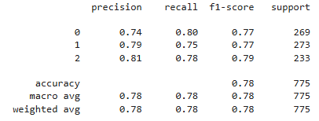
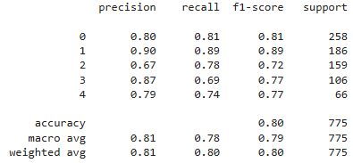

# Customer ticket classification
This project intends to classify departments and priority based on IT issue tickets from customers. 
I have conducted two classification to categorize priorities and queues based on customer IT tickets. 

The dataset used is from Kaggle - [Customer IT Support - Ticket Dataset](https://www.kaggle.com/datasets/tobiasbueck/multilingual-customer-support-tickets?select=dataset-tickets-multi-lang-4-20k.csv)
The dataset includes descriptions from tickets, priorities, queues, types, tags, and business types. 

* Queue : it specifies the department to which the email ticket should be categorized. This helps in routing the ticket
to the appropriate support team.  

  * Returns and Exchanges
  * Service Outages and Maintenance
  * Sales and Pre-Sales
  * Human Resources
  * General Inquiry

* Priority : it indicates the urgency and importance of the issue. it helps in managing the workflow by prioritizing
tickets that need immediate attention.
  * high
  * medium
  * low 

Since the target distributions are not balanced, LDA (latent Dirichlet allocation) and SMOTE were applied to 
improve the performance of training.   

[ Workflow ]
* Trained LDA on the corpus  
* Represented each document as its topic probability vector 
* Combined these features with other numerical or textual features - OpenAI embedding used for embedding.  
* Trained a supervised classifier (Support Vector Machine, Random Forest, Light Gradient Boosting)  
* Evaluated the training results suing classificiation report  

## 1. Classification of minority priorities   

The best performance was achieved by Light GB model with hyperparameter tuning.   

[ Labels ]  
* 0: medium  
* 1: low  
* 2 : high  

[ Light GB Model Results ]

* Support Vector Machine F1 Score : medium (58%), low (62%), high (66%)    
* Random Forest F1 Score : medium (73%), low (75%), high (76%)  

## 2. Classification of minority queues   

The best performance was achieved by Light GB model with hyperparameter tuning.

[ Labels ]  
* 0: Returns and Exchange   
* 1: Service Outages and Maintenance  
* 2 : Sales and Pre-Sales 
* 3 : Human Resources
* 4 : General Inquiry  

[ Light GB Model Results ]

 
* Support Vector Machine F1 Score:  

  * Returns and Exchange - 63%   
  * Service Outages and Maintenance - 82%
  * Sales and Pre-Sales - 60% 
  * Human Resources - 62%
  * General Inquiry - 53%   

* Random Forest F1 Score:  

  * Returns and Exchange - 76%   
  * Service Outages and Maintenance - 86%
  * Sales and Pre-Sales - 71% 
  * Human Resources - 72%
  * General Inquiry - 70%
